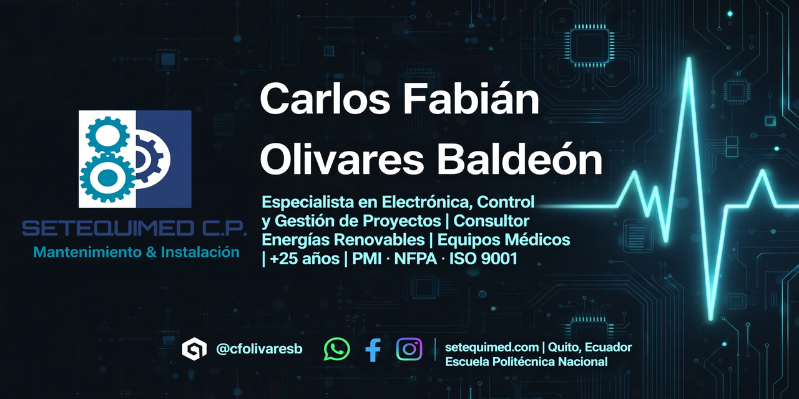

# Hi there, I'm Carlos Olivares! 👋

 <h1 align="center">Carlos Fabián Olivares Baldeón</h1> <h3 align="center">Especialista en Electrónica, Control y Gestión de Proyectos | Consultor en Energías Renovables - Equipos Médicos - Seguridad Electrónica</h3> 
     
 
      

## About Me 🚀

I'm a passionate **[Your Job Title / Developer Role]** with experience in **[technologies you're proficient in]**. I love tackling complex problems, learning new skills, and collaborating with diverse teams to create innovative solutions.

- 🌱 Currently learning: **[new technologies or skills you're currently learning]**
- 🔭 Working on: **[current projects or side-projects]**
- 🌍 Languages: **[programming languages and human languages you speak]**
- 📫 How to reach me: **[your email address or other contact information]**
- ⚡ Fun fact: **[a fun fact about yourself]**

## My Skills 🧠

*Replace the above skill badges with your own skills and expertise. To create more badges, use [checkout this repo](https://github.com/alexandresanlim/Badges4-README.md-Profile).*

## Featured Projects 💻

### [Project 1 Title](project_1_link)

**[Project 1 Title]** is a **[brief project description]** built with **[technologies used]**. This project demonstrates my ability to **[skills demonstrated by the project]**. You can check out the repository [here](project_1_repository_link).

### [Project 2 Title](project_2_link)

**[Project 2 Title]** is a **[brief project description]** built with **[technologies used]**. This project showcases my skills in **[skills demonstrated by the project]**. You can check out the repository [here](project_2_repository_link).

## Get in Touch 📬

- **[Personal Website / Blog]**(your_website_or_blog_link)
- **[LinkedIn]**(your_linkedin_profile_link)
- **[Twitter]**(your_twitter_profile_link)

